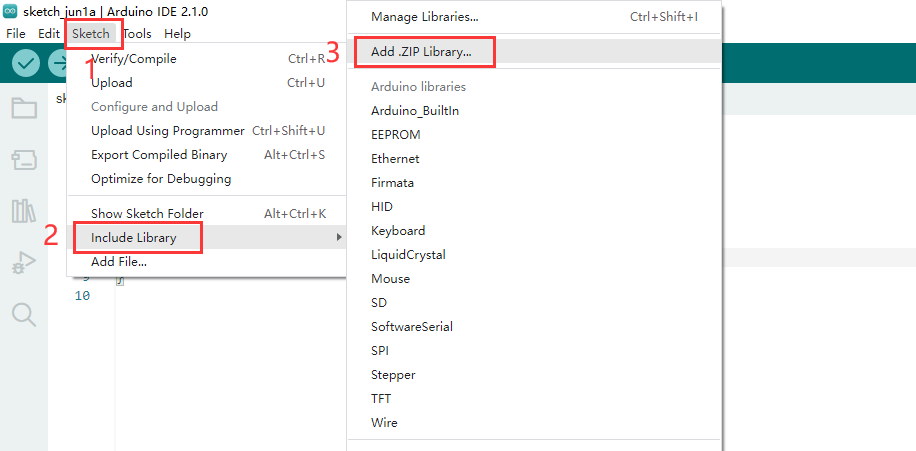
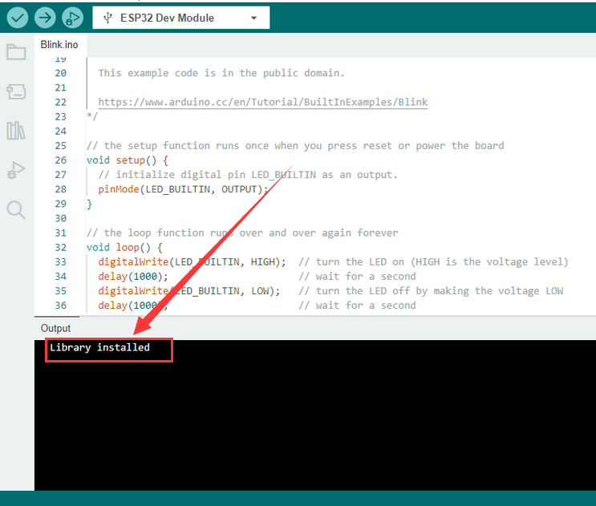

# **Arduino IDE Tutorial**

## 1. Download arduino IDE

### **A. Windows System**

You could download Arduino IDE from the official website: [https://www.arduino.cc/](https://www.arduino.cc/)

Enter the link and click **SOFTWARE**: 

There are various versions of IDE for Arduino. Just download a version compatible with your system. 

Here we will show you how to download and install the windows version of Arduino IDE. 

There are two versions of IDE for WINDOWS system. You can choose between the installer (.exe) and the Zip file. For installer, it can be directly downloaded, without the need of installing it manually while for Zip package, you will need to install the driver manually.

You just need to click **JUST DOWNLOAD**.

### **B. Mac System**

The versions of Arduino IDE vary from operation systems.

For how to download Arduino IDE on Mac, please refer to Windows:

After downloading, double-click to open it and follow the installation instructions.

## **2. Install Driver**

We need a driver to boot our development board. Or else, the COM port connected to computer will not be found. 

For details, please refer to the following table:

| Development Board | Driver |           Windows System           |         MAC System         |
| :---------------: | :----: | :--------------------------------: | :------------------------: |
|       NANO        | CH340  |  [CH340-WINDOWS](windowsCH340.md)  |  [CH340-MAC](MacCH340.md)  |
|  ESP32,Plus UNO   | CP2102 | [CP2102-WINDOWS](windowsCP2102.md) | [CP2102-MAC](MacCP2102.md) |

## **3. Arduino IDE Settings**

Clickicon to open Arduino IDE.

1. “File”: Including New Sketch, Open..., Sketchbook, Examples, Close, Save(Save as...), Preferences, Advanced..., etc.
2. “Edit”: Including Copy, Paste, Auto Format, Increase/Decrease Font Size, etc. Commonly, you can use shortcuts to do these operations.
3. “Sketch”: Including Verify/Compile, Upload, Include Library, etc.
4. “Tools”: Including Board and Port, which are two of the most important functions. 
5. “Help”: Including Check for Updates as well as some official data references. 
6. “Serial Plotter”: To display the data from serial port in the way of a line chart.
7. “Serial Monitor”: To prints the data from serial port. 
8. Verify code.
9. Verify and upload code.
10.  “Sketchbook”: To create a new sketch, or sign in to Arduino Cloud to sync and edit your Cloud Sketches.
11. “Boards Manager”: To install or remove development board. 
12. “Library Manager”: To install or remove library.
13. “Debug”: To monitor code and debug breakpoints.
14. Search.
15. Sketch editing area.
16. IDE Output: To report error or successful uploading, and to display data from serial monitor.

## **4. Upload Code via Arduino IED**

**“ / ” means the same as Keyestudio Plus UNO Tutorial.**

| Development board             |           windows system            |             MAC system              |
| :---------------------------- | :---------------------------------: | :---------------------------------: |
| Keyestudio Plus UNO           | [Win Plus UNO Tutorial](win-UNO.md) | [Mac Plus UNO Tutorial](mac-UNO.md) |
| Keyestudio NANO               |                  /                  |                  /                  |
| Keyestudio MEGA 2560          |                  /                  |                  /                  |
| Keyestudio Leonardo           |                  /                  |                  /                  |
| Keyestudio Micro pro\por Mini |                  /                  |                  /                  |
| Keyestudio ESP32\ESP32 Plus   |   [Win ESP32 Tutorial](win-ESP32)   |   [Mac ESP32 Tutorial](mac-ESP32)   |
| raspberry pi pico             |    [Win Pico Tutorial](win-Pico)    |    [Mac Pico Tutorial](mac-Pico)    |

## **5. Import Library**

First of all, the corresponding Arduino library files are required. 

### **1) What are Libraries ?**

Libraries are a collection of code that make it easy for you to connect a sensor,display, module, etc.

For example, the built-in LiquidCrystal library helps talk to LCD displays. 

There are hundreds of additional libraries available on the Internet for download. The built-in libraries and some of these additional libraries are listed in the reference.

### **2) How to Install a Library ?**

Here we will introduce the most simple way to add libraries.

Click **Skerch > Include Library > Add .Zip Library...** in sequence. 

Find files(.zip) you need to add as library and wait. “**Library installed**” will be displayed if library is successfully added.

For how to include a library, the method of the two system is the same. 

For more details, please visit our official website: [https://www.keyestudio.com/](https://www.keyestudio.com/)

