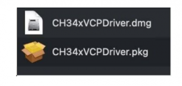
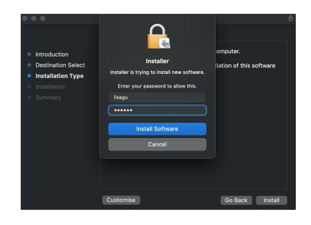

# **Install CH340 Driver on MAC System**

**Step 1**: Download the driver from the Website and extract the file to the local installation directory.

**Step 2**: For details about how to install the driver in pkg format by default, see Step 3. If OS X 11.0 or later does not support Rosetta, refer to Step 4 to install the dmg driver.

Before installation, please forward to “System Preferences” -> “Security & Privacy” -> “General” page, below the title “Allow apps downloaded from:” choose the choice 2 -> “Mac App Store and identified developers”, then the driver will work normally.

**Step 3**: To install the driver in pkg format, tap the driver file → Continue→ Install

Then the installation will be successful.

To install the pkg format driver on OS X 11.0 and later: Open “LaunchPad” → “CH34xVCPDriver” → Install.

When using OS X 10.9 to OS X 10.15, click “Restart” to restart your computer, and perform the following steps after the restart.

**Step 4**: To install the dmg driver, tap the dmg file and drag “CH34xVCPDriver” to enter the application folder in the operating system.

Then open “LaunchPad” → “CH34xVCPDriver” → Install.

Then the installation will be successful.

When inserting the CH340 control board into the USB port, open System Report -> Hardware ->USB. On the right is USB Device Tree. If the USB device is working properly, you will find a device whose “Vendor ID” is [0x1a86].

Open “Terminal” program under Applications-Utilities folder and type the command “ls /dev/tty*”.

You should see the “tty.wchusbserialx” where “x” is the assigned device number similar to Windows COM port assignment.