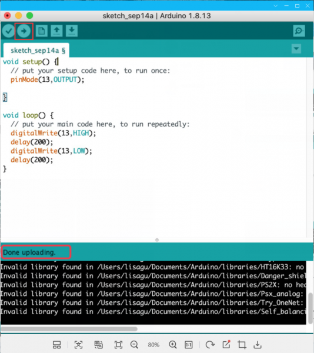
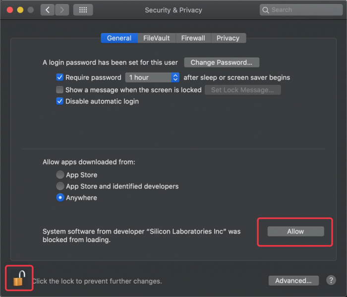

# **Install CP2102 Driver on MAC System**

Connect board we provide to your computer, and open Arduino IDE.

Click "Tools" to select **Board: Arduino Uno** and **Port: /dev/cu.usbserial-0001**.

Tap  to upload code, if burn successfully, you will view Done uploading.

Note: If burn unsuccessfully, you need to install driver of CP2102, please continue to follow the instructions as below:

Download the driver of CP2102:[https://www.silabs.com/products/development-tools/software/usb-to-uart-bridge-vcp-drivers](https://www.silabs.com/products/development-tools/software/usb-to-uart-bridge-vcp-drivers)

1\. Select Mac OSX edition

2\. Unzip the downloaded package

3\. Open folder and double-click SiLabsUSBDriverDisk.dmg file.

4\. You will view the following files as follows:

5\. Double-click Install CP210x VCP Driver, tick Don’t warn me and tap Open.

6\. Tap Continue

7\. Tap Continue and Agree

8\. Click Continue and input your password

9\. Select Open Security Preferences

10\. Click the lock to unlock security & privacy preference.

11\. Then click Allow

12\. Back to installation page, and wait to install.

13\. Successfully installed

14\. Then enter ArduinoIDE, click Tools and select Board: Arduino Uno and /dev/cu.SLAB_USBtoUAPT

15\. Click to upload code and you will see “Done uploading”.

