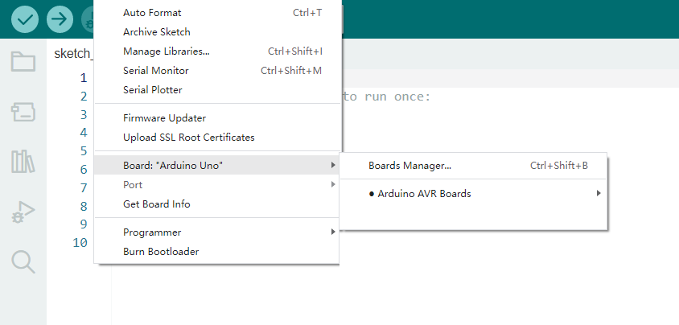

# **Pico Development Board for Mac**

Typically, we cannot find Pico board from “Board” in “Tools”. Because we have not install this board on Arduino IDE yet.

Here are the procedures of Pico board installation.

Open Arduino IDE. Then click Board Manager:

In the search bar, type in **Pico** and search to install **Arduino Mbed OS RP2040 Boards**. 

When “**Install**” becomes “**REMOVE**”,and a prompt pops up, installation is successfully complete. 

Now you can find pico board in “Board”!

The following step is extremely essential: Upload Pico firmware that is compatible with arduino. Because arduino IDE cannot burn programs on Pico board if there is no such firmware. 

For how, lease refer to the configuration below: 

（1）Disconnect Raspberry Pi Pico to computer. Press and hold the white button(BOOTSEL) on Raspberry Pi Pico until the board is linked to PC. (Always remember to hold the button until connection is finished, or else firware fails to be downloaded. )

 

（2）Open Arduino IDE, click **File** → **Examples** → **01.Basics** → **Blink**.

 

（3）Click **Tools** → **Board** → **Arduino Mbed OS RP2040 Boards** → **Raspberry Pi Pico**.

 

（4）Upload Sketch **Blink** to Pico and click to compile the code. **Done uploading** will be displayed after successful uploading. 

 

The indicator on Pico board will blink per second. 

Click **Tools** → **Port** → **/dev/cu.sudmodem14101(Raspberry Pi Pico)**. 

**NOTE**

**A.** **Uploading Sketch via Arduino to Pico for the first time, no port selection required. Yet, every time after that, you need to check whether the port is selected; otherwise the download may fail.**

**B.** **Sometimes, Pico board may not work due to firmware missing. At this moment, please upload firmware again.**

