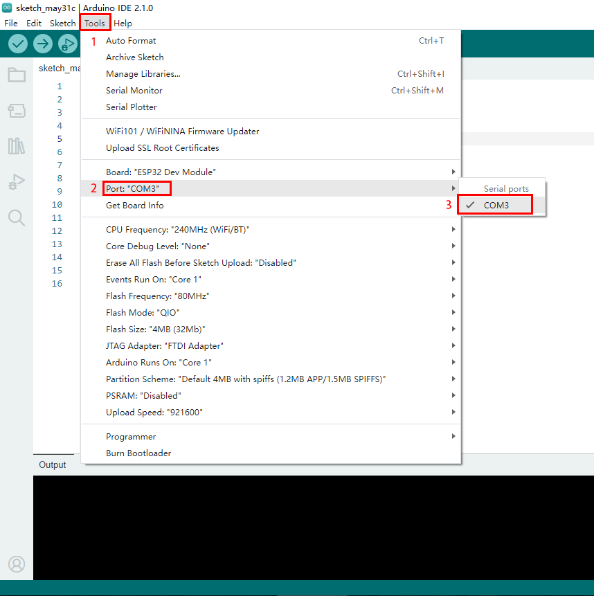

# **Windows Arduino IDE ESP32 Development Board**

Typically, we cannot find ESP32 board from “Board” in “Tools”. Because we have not install this board on Arduino IDE yet.

Here are the procedures of ESP32 board installation:

Open Arduino IDE.

Click “**Arduino IDE** ——>**Preferences**”. 

Copy the link of ESP32 board (https://espressif.github.io/arduino-esp32/package_esp32_index.json) to Additional boards manager URLs, and tap OK.

-1682391415970-35.png)

Click the icon of "Board Manager" to check for boards.

-1682391426145-37.png)

In the search bar, type in ESP32 and search to install the latest version. Then you just need to wait a few minutes for the installation to complete. 

**During installing, please ensure the stability of network. If it fails, please operate last step again to re-install.**

-1682391436611-39.png)

After installation, select the right board model.

-1682391446503-41.png)

Choose the correct COM port.

If there are so many ports that you have no idea which is the correct one, you may unplug the board to check which one disappears. If there is no COM port, please check whether the driver is installed.


In our demostration, the port is COM3, so we click “Tools” to choose “COM3” in “Port”.



If your board is successfully connected, it will show on the interface. Now you can try to upload code. An examples code is provided here: it will print “Hello Keyestudio!” per second.

Copy and paste the following code to Arduino IDE: 

```c
/*
  keyestudio 
  Print “Hello Keyestudio!”
  http://www.keyestudio.com
*/
void setup() {  
    // put your setup code here, to run once:
    Serial.begin(9600);  //Set the serial port baud rate to 9600
}

void loop() {  
    // put your main code here, to run repeatedly:
    Serial.println("Hello Keyestudio!");  //Serial port printing
 	delay(1000);  //Delay of 1 second
}
```


Click to compile the code. If it succeeds, the following two show up:


While uploading, if it outputs “————……..————……..”, please press and hold “**Boot**” button on your board. However, this only works for Keyestudio ESP32 development board (Keyestudio Plus ESP32 is excluded).

Click and set baud rate to 9600, and “Hello Keyestudio!” are being printed!


1. “Toggle Autoscroll”: To set whether to follow the print.
2. “Toggle Timestamp”: To set whether to display printing time.
3. “Clear Output”: To clear the output data.
4. Serial Input
5. Serial port sending format
6. Baud rate: To set the baud rate.
7. Printing box.

This is the end of how to upload code!

Now please import libraries for IDE, otherwise an error will occur. 


