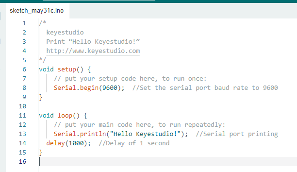

# **UNO Development Board for Windows****

Upload code: An examples code is provided here: it will print “Hello Keyestudio!” per second.

Copy and paste the following code to Arduino IDE: 

```c
/*
  keyestudio 
  Print “Hello Keyestudio!”
  http://www.keyestudio.com
*/
void setup() {  
    // put your setup code here, to run once:
    Serial.begin(9600);  //Set the serial port baud rate to 9600
}

void loop() {  
    // put your main code here, to run repeatedly:
    Serial.println("Hello Keyestudio!");  //Serial port printing
 	delay(1000);  //Delay of 1 second
}
```



Click “Tools”——>“Board”——> Arduino AVR Boards, and here we choose Arduino Uno as our development board. 


Choose the correct COM port.

If there are so many ports that you have no idea which is the correct one, you may unplug the board to check which one disappears. If there is no COM port, please check whether the driver is installed.


In our demostration, the port is COM3, so we click “Tools”to choose“COM3” in “Port”.


If your board is successfully connected, it will show on the interface. 


Click to compile the code. If it succeeds, the following two show up:


Click and set baud rate to 9600, and “Hello Keyestudio!” are being printed!


1. “Toggle Autoscroll”: To set whether to follow the print.
2. “Toggle Timestamp”: To set whether to display printing time.
3. “Clear Output”: To clear the output data.
4. Serial Input
5. Serial port sending format
6. Baud rate: To set the baud rate.
7. Printing box.

This is the end of how to upload code!

Now please import libraries for IDE, otherwise an error will occur. 


