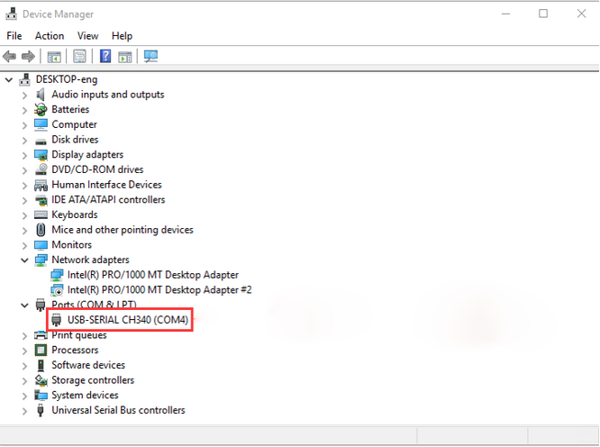

#  **Install CH340 Driver on Windows System**

Download: [https://fs.keyestudio.com/CH340-WINDOWS](https://fs.keyestudio.com/CH340-WINDOWS)

Windows 10 (and later systems) boasts their own drivers, so there is no need to install additional drivers.

Connect the control board to your computer.

Click Computer-- Properties -- Device Manager, as shown below. This indicates a successful connection, so the installation of driver is not required. 

If the following situation occurs, you need to manually install the driver.

.png)

Click to select “Update driver”. And then the driver will start to install. 

.png)

Tap "Browse my computer for drivers".

.png)

Find the file **usb_ch341_3.1.2009.06** or **cp210x** you have downloaded, and click "Next".

.png)

After finishing installing, click "Close" and the serial port number will show up. 

.png)

The driver is successfully installed!

Click Computer-- Properties -- Device Manager to check: 

